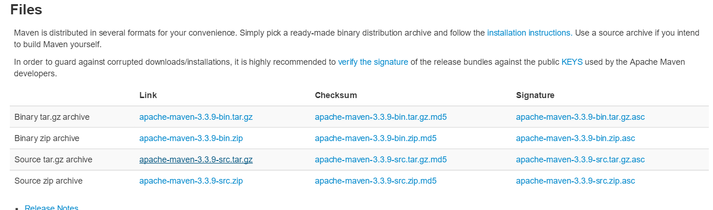

# Maven 설치

- 작성일 : 2017-03-20

## 1. Maven이란 ?

```
Apache Maven is a software project management and comprehension tool. Based on the concept of a project object model (POM), Maven can manage a project's build, reporting and documentation from a central piece of information.
```

Maven 홈페이지(http://maven.apache.org/) 들어가보면 위와 같이 정의되어 있다.

pom.xml 파일을 기반으로 프로젝트의 라이브러리 관리를 해주며, 프로젝트 빌드와 리포팅 그리고 문서화 등과 같은 기능을 가진다.

요즘 Gradle도 많이 사용하지만 스프링 프레임워크에는 아직 메이븐이 더 많이 보이는 것 같다.

## 2. Maven 설치

### 2.1 Maven 홈페이지 접속

- http://maven.apache.org/download.cgi

### 2.2 Maven 다운로드


- 해당 화면에서 압축파일을 다운로드 한다.

### 2.3 압축 해제

- 압축을 해제하여 본인이 원하는 위치로 옮긴다

### 2.4 환경 변수 설정

- Ctrl + R을 눌러 control system을 입력한다.
<br/>


- 고급 시스템 설정을 선택 > 고급 탭 > 환경 변수를 누른다.
<br/>

<br/>

- 새로 만들기 버튼을 누르고 변수 이름에 **MAVEN_HOME** 을 입력하고 변수 값에는 메이븐 폴더가 위치한 경로를 입력한다.
<br/>
  
<br/>

- path 편집 버튼을 누른 후 **%MAVEN_HOME%\bin** 을 추가한다.
<br/>

<br/>

- Ctrl + R을 누르고 cmd를 입력한 후 mvn -version을 입력하여 환경 변수가 제대로 설정되었는지 확인한다.
<br/>


## 3. 이클립스 연동

- Window  > Preferences > Maven > Installations > add
<br/>

<br/>

- Maven 폴더의 경로를 선택하고 Finish
<br/>

<br/>

- Window > Preferences > Maven > User Settings 에서 User Settings를
***메이븐이 설치된 경로\conf\settings.xml*** 로 설정하고 OK를 누른다.
<br/>

<br/>

- 추가로 Local Repository의 위치를 변경하고 싶다면 settings.xml에서 \<LocalRepsitory>안의 경로를 수정하면 된다.
<br/>

<br/>
