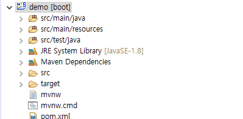
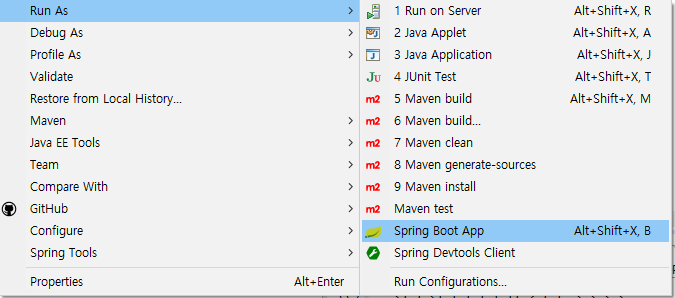
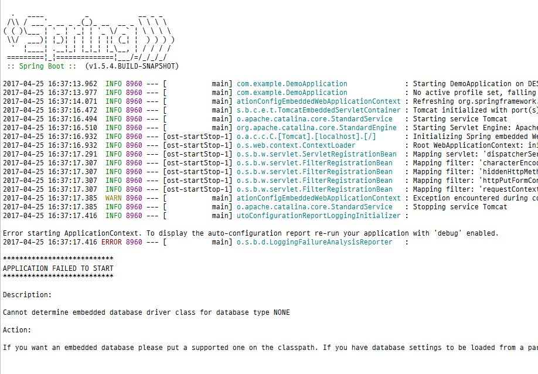
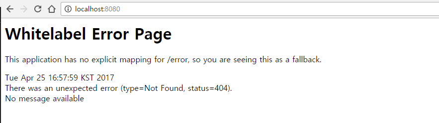
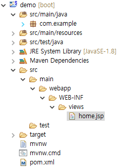
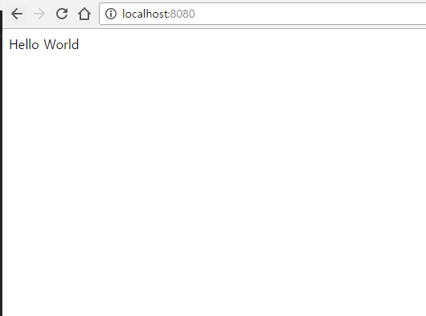

# Spring Boot 실행시켜보기

- 작성일 : 2017-04-25

## 사전 준비

- [Spring Boot 프로젝트 생성](http://override1592.tistory.com/8)

## 프로젝트 구조

지난번 글을 보고, Eclipse에 Import까지 무사히 하였다면 아래와 같은 구조를 볼 수 있을 것이다.



## 실행시켜보기

일단 거두절미하고 한번 실행시켜보자.



프로젝트를 마우스 우클릭하여 Run As > Spring Boot App을 클릭한다.
또는 Alt + Shift + X 버튼을 누른 후 B버튼을 눌러도 동일하다.

실행을 시켜보면 제일먼저 Spring 로고가 보이고 로그들이 잔뜩 찍히는걸 확인할 수 있다.

근데 저번 블로그 글과 똑같이 프로젝트를 생성했다면 어플리케이션이 실행되다가 아래와 같이 에러가 발생하는 것을 볼 수 있을 것이다.



이는 JPA를 사용하기 위해서 pom.xml에 dependency를 추가해 놓고 DB설정을 하지 않았기 때문인데,
지금 당장 DB를 사용할 것은 아니기 때문에 pom.xml에 가서 아래와 같이 주석처리를 해준다.

```xml
<dependencies>
		<!-- <dependency>
			<groupId>org.springframework.boot</groupId>
			<artifactId>spring-boot-starter-data-jpa</artifactId>
		</dependency> -->

        ...

</dependencies>
```

그리고 다시 한번 실행을 시켜보자.

아까와는 달리 에러 없이 실행된 것을 볼 수 있다.

인터넷 창을 띄워 http://localhost:8080 를 주소창에 입력시키면 아래와 같이 나타날 것이다.



Controller를 통한 mapping이 되어있지 않기 때문에, 페이지를 찾을 수 없어 위와 같은 오류가 발생하는 것이다.

## 간단한 Controller 만들어보기

### view단 설정

일단 컨트롤러를 만들기 전에 home화면에 보여줄 jsp 파일부터 만든다.

src/main/webapp에 WEB-INF 폴더를 만들고 그 하위에 views 폴더를 만든다. views폴더에 home.jsp파일을 생성한다.



home.jsp 파일의 body 부분에 Hello World라고 입력해준다.

```html
...

<body>
    Hello World
</body>

...
```

Spring Boot에서는 JSP를 사용하기 위해 pom.xml에 아래와 같이 입력해줘야 한다.

```xml
<dependencies>
    ...

    <dependency>
        <groupId>javax.servlet</groupId>
        <artifactId>jstl</artifactId>
    </dependency>
    <dependency>
        <groupId>org.apache.tomcat.embed</groupId>
        <artifactId>tomcat-embed-jasper</artifactId>
    </dependency>

    ...
</dependencies>
```

다음으로는 view단에 대한 prefix와 suffix 설정을 해줘야하는데

src/main/resources에 보면 application.properties 파일이 있을 것이다.
이 파일로 스프링 부트는 해당 파일을 통해 여러가지 설정이 가능하다. 아래와 같이 입력한다.

```properties
spring.mvc.view.prefix=/WEB-INF/views/
spring.mvc.view.suffix=.jsp
```

### controller 생성

다음으로는 컨트롤러를 만드는데,
com.example.controller 라는 패키지를 만들고 그 아래에 HomeController.java 파일을 만든다.

그리고 아래와 같이 입력한다.

```java
import org.springframework.stereotype.Controller;
import org.springframework.web.bind.annotation.RequestMapping;

@Controller
public class HomeController {

	@RequestMapping("/")
	public String home() {
		return "home";
	}
}
```

이 컨트롤러는 "/"경로 즉 root경로에 대한 요청이 왔을 경우 home.jsp 파일을 보여주겠다는 의미이다.

다 설정 하였으면, 아까와 같이 다시한번 실행한 후에 다시 한번 http://localhost:8080 으로 접속해본다.



드디어 Hello World가 출력되는 것을 볼 수 있다.
