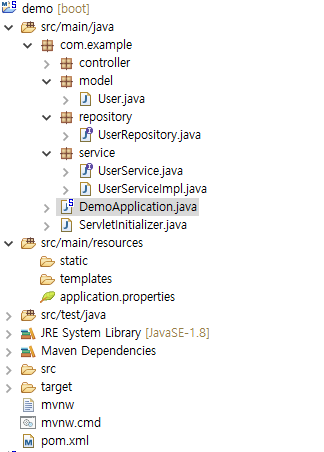

# Spring Boot DB 연동하기

- 작성일 : 2017-04-27

스프링 부트를 실행시켜봤으니 이번에는 간단한 예제를 통해 DB와 연동하는 법을 알아본다.
이 예제를 따라하려면 반드시 데이터베이스가 설치되어있어야 한다.

## 사전 준비

MariaDB 또는 Mysql 설치 필요

## DB생성 및 테이블 생성

일단 예제를 작성하기 위해 DB를 생성하고 유저 테이블도 생성한다.

```sql
CREATE DATABASE `springtest`; /*DB생성*/

USE `springtest`;

CREATE TABLE `USER` ( /* USER테이블 생성 */
	`USER_NO` INT(11) NOT NULL AUTO_INCREMENT,
	`USER_ID` VARCHAR(20) NULL DEFAULT NULL,
	`USER_NM` VARCHAR(20) NULL DEFAULT NULL,
	`USER_PASSWD` VARCHAR(40) NULL DEFAULT NULL,
	`USER_EMAIL` VARCHAR(50) NULL DEFAULT NULL,
	`USER_TEL` VARCHAR(20) NULL DEFAULT NULL,
	`REG_DT` DATETIME NULL DEFAULT NULL,
	PRIMARY KEY (`USER_NO`)
);
```

## dependency 추가

다음은 저번 포스트에서 주석처리 했던 `spring-boot-starter-jpa`의 주석을 풀어 다시 추가한다.
없으면 그냥 복사해서 붙여넣으면 된다.

그리고 마리아 db를 사용하기 위해 mariadb jdbc도 추가해야 한다.

```xml
<dependencies>
	<dependency>
		<groupId>org.springframework.boot</groupId>
		<artifactId>spring-boot-starter-data-jpa</artifactId>
	</dependency>
	<dependency>
        <groupId>org.mariadb.jdbc</groupId>
        <artifactId>mariadb-java-client</artifactId>
    </dependency>
...

</dependencies>

```

## DB 설정

```properties
spring.mvc.view.prefix=/WEB-INF/views/
spring.mvc.view.suffix=.jsp

spring.datasource.driver-class-name= org.mariadb.jdbc.Driver
spring.datasource.url=jdbc:mariadb://localhost:3306/springtest
spring.datasource.username=DB유저네임
spring.datasource.password=DB유저비밀번호
```

## 도메인, 리파지토리, 서비스 생성

DB를 연동하였으면, 이제는 DB를 사용하기 위한 클래스들을 만들어 보자



위와 같은 구조로 만들면 된다.

### User.java

```java
@Entity
@Table
public class User {

	@Id
	@Column
	private Integer userNo;

	@Column
	private String userId;

	@Column
	private String userName;

	@Column
	private String userPasswd;

	@Column
	private String email;

	@Column
	private String tel;

	@Column
	private Date regDt;

    ...
	/* getter, setter */
	...


	@Override
	public String toString() {
		return "User [userNo=" + userNo + ", userId=" + userId + ", userName=" + userName + ", userPasswd=" + userPasswd + ", email=" + email + ", tel=" + tel + ", regDt=" + regDt + "]";
	}

}
```

클래스 위에 @Entity와 @Table을 사용하였는데,
@Entity 어노테이션은 해당 클래스가 Entity Bean이라고 표시하는 것이며,
@Table 어노테이션은 이 클래스가 DB Entity의 영속상태로 사용될 수 있음을 의미한다.
@Column 어노테이션은 해당 필드와 Entity의 컬럼을 매핑시켜준다.

### UserRepository.java

```java
public interface UserRepository extends JpaRepository<User, Integer> {

}
```

### UserService.java

```java
public interface UserService {

}
```

### UserServiceImpl.java

```java
@Service
public class UserServiceImpl implements UserService{

}
```
