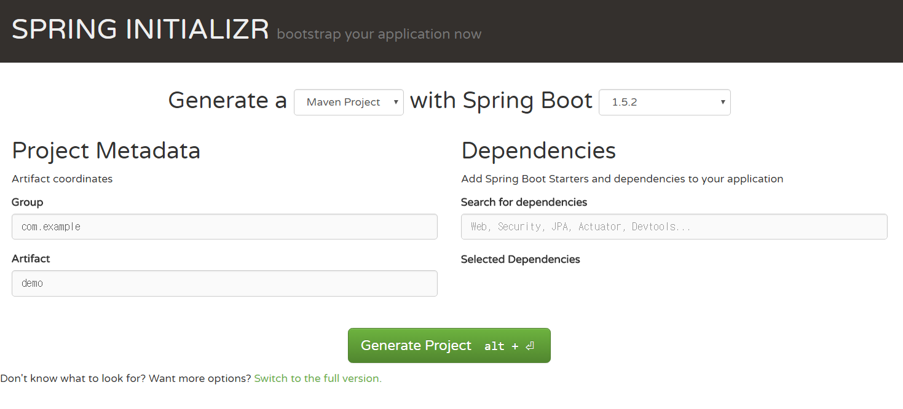
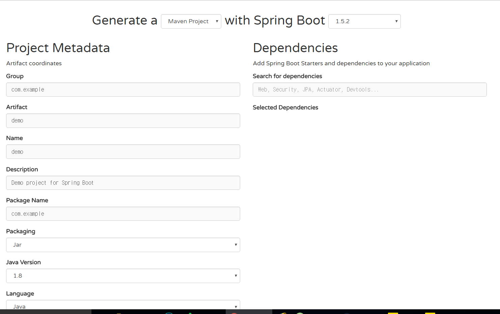
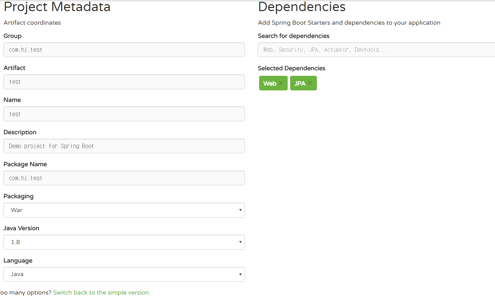
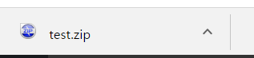
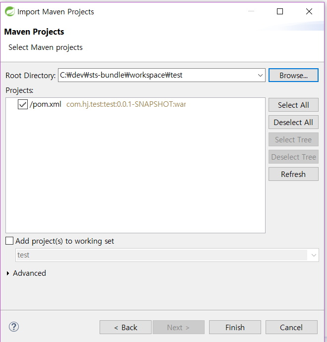
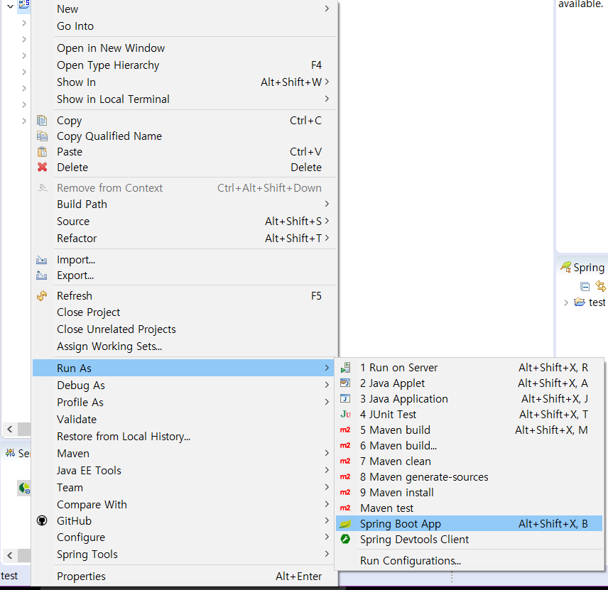

# Spring Boot 시작하기

- 작성일 : 2017-03-21

## 0. 사전 준비
- JDK 8 설치
- Maven 설치

## 1. 스프링 부트란 ?

> 스프링 부트는 드롭 위저드에 영향을 받아 개발되었으며, 스프링 프레임워크를 제작한 노하우가 적용으며 다음과 같은 특징을 갖는다.

```
- 자주 사용하는 프로젝트 조합을 미리 준비해놓았다.
- 설정의 자동화
- 서버를 포함하고 있다.
```

> 스프링 부트 가이드 문서에 보면 스프링 부트의 목표에 대하여 다음과 같이 나와있다.

```
- Provide a radically faster and widely accessible getting started experience for all Spring development.
- Be opinionated out of the box, but get out of the way quickly as requirements start to diverge from the defaults.
- Provide a range of non-functional features that are common to large classes of projects
 (e.g. embedded servers, security, metrics, health checks, externalized configuration).
- Absolutely no code generation and no requirement for XML configuration.
```
라고 영어로 적혀있다 알아서 해석해서 보시길...

> 사실 한글로 번역된 문서가 있다.

```
- 매우 빠르고 모든 스프링 개발에 관한 경험에 관한 광범위한 접근을 제공한다.
- 차이가 있기는 하겠지만, 기본값으로 부터 요구사항들에 따라 분기하며 빠르게 진행할 수 있다.
- 일반적으로 프로젝트에서 큰 영역을 차지하는 비기능적인 기능들을 제공한다
  (예를 들어, 내장형 서버, 시큐리티, 측정, 상태 점검, 외부 설정)
- 절대적으로 XML 설정을 요구하거나 더이상의 코드를 작성하지 않는다.
```

## 2. 스프링 부트 프로젝트 생성하기

Spring Boot Project를 쉽게 만드는 방법으로 **SPRING INITIALIZR** 가 있다.

[SPRING INITIALIZR](https://start.spring.io/)

위 사이트에 들어가면 아래와 같은 화면이 나온다.



저 칸들을 채워주는 것만으로도 스프링 부트 프로젝트가 만들어진다니 정말 편리하다.

- Group, Artifact
  - 프로젝트의 GroupID와 ArtifactId를 입력하는 칸이다.
- Search for dependencies
  - 프로젝트에 추가하고 싶은 Dependency들을 추가하는 칸이다.

> 칸을 모두 채워 준 후 alt + Enter 또는 Generate Project라고 써져있는 녹색 버튼을 누르면 생성된 프로젝트가 다운로드된다.

좀 더 자세한 설정을 하고싶다면


녹색 버튼 밑에 **Switch to the full version** 을 클릭하면



위와 같이 좀 더 상세한 설정이 가능해진다. 또한 밑에 보면 추가할 수 있는 dependency들 목록이 보여 체크박스를 체크하는 것 만으로 추가가 된다.

나는 다음과 같이 설정을 했다.



> Web 어플리케이션을 만들것이기 때문에 Web을 추가했고, JPA와 Maria DB를 사용하기 위해 JPA를 추가했다.  
Maria DB는 선택 항목 중에 없어서 프로젝트 생성 이후에 pom.xml 파일에 추가를 할 계획이다.

설정 후 다운로드를 하면 이와 같이 압축된 형태로 다운로드 된다.



해당 파일의 압축을 해제한 후 본인이 원하는 위치로 이동하면 된다.

## 3. STS(또는 Eclipse)에 생성된 프로젝트 Import하기

> 프로젝트를 생성했으면 IDE에 Import를 해야할 것이다. 나는 STS를 사용하기 때문에 STS에 Import를 한다. 그러나 Eclipse에 해도 방식은 똑같다.

- 먼저 STS(Eclipse)를 실행한다.
- File > Import > Existing Maven Project를 선택한다.
- 아까 다운 받은 프로젝트를 추가한다.

- 프로젝트가 추가됬으면 아래와 같이 실행을 시켜본다.

- 실행이 됐으면 http://localhost:8080/ 로 확인을 하면 된다.
