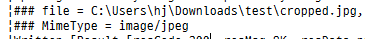
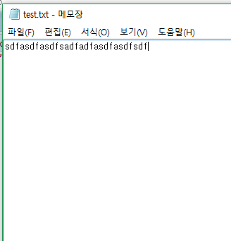
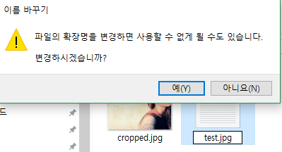
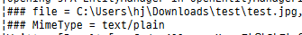

# 업로드 파일의 MIME TYPE 체크하기

작성일 : 2017-04-24

> 이 문서는 SpringBoot를 기준으로 작성하였습니다.

이미지 파일을 업로드하는 기능을 구현하는데, 업로드 되는 파일이 이미지 파일인지 아닌지 확인을 하고 싶었다.
이를 확인하는 방법으론 간단하게 해당 파일의 확장자를 가지고 판단을 하면 될 것이다.
그러나 이러한 방법은 파일의 확장자만 이미지 형식으로 바꾼 스크립트 파일인 `Web Shell`과 같은 공격에 당하기 십상이다.
때문에 확장자 검사 이외에도 파일의 MIME Type을 확인하는 로직을 추가하였는데, `Apache Tika`를 사용하였다.

## What is Apache Tika?


`ApacheTika`는 수천개의 다른 종류의 메타데이터나 텍스트들의 내부 컨텐츠를 검색할 수 있는 툴킷이다.

##  Apache Tika로 MIME Type 체크하기

### pom.xml에 dependency 추가

```xml
<!-- Tika -->
<dependency>
    <groupId>org.apache.tika</groupId>
    <artifactId>tika-core</artifactId>
    <version>1.14</version>
</dependency>
```

### 해당 파일의 MIME TYPE이 이미지 형식인지 확인하는 메서드

```java
/**
  * MIME TYPE 확인
  * @param input
  * @return
  * @throws IOException
  */
	public static boolean checkImageMimeType(InputStream file) throws IOException {

		Tika tika = new Tika();

		String mimeType = tika.detect(input);

		logger.debug("### MIME Type = {}", mimeType);

		if (mimeType.startsWith("image")) {
			return true;
		} else {
			return false;
		}

	}
```

MIME TYPE이 `image`로 시작하면 `true` 반환

### Test

위 코드를 사용하여 테스트를 해보자. 우선 주로 사용하는 jpg파일을 업로드 해봤다.


이미지를 업로드하고 로그를 확인하면



해당 파일이 어떤 MIME type을 가지고 있는지 로그를 통하여 볼 수 있다. 지금 업로드한 이미지의 MIME Type은 image/jpeg인걸 확인할 수 있다.

다음은 가짜 이미지 파일을 만들어보자.



메모장을 열어 아무렇게나 입력하고 저장해준다.



그리고 첫 번째 테스트와 같은 확장자인 jpg로 확장자를 강제 변경해준다.


변경한 파일을 업로드해보면



파일의 확장자는 jpg이지만 MimeType은 text/plain이라는 것을 확인할 수 있다.

위와 같이 파일 업로드 기능을 구현할 때 `Apache Tika` 를 사용해서 해당 파일의 MIME Type을 간단히 확인할 수 있다.
